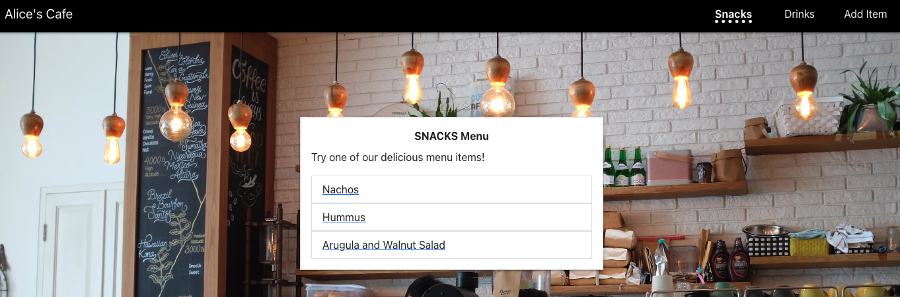

# ☕ Alice's Cafe



Alice's Cafe is cafe menu website built in React.

Users have the functionality to:

- Add items to the menu
- View snacks and drinks on the menu
- View details of a single snack or drink
- View how many snacks and drinks there are

#### Built with: Javascript, React, [JSON-Server](https://www.npmjs.com/package/json-server)

## React Component Hierarchy


## Installation

1. Open terminal window and run:
   ```
   npm i
   npm start
   ```
2. Open another terminal window and run:
   ```
   npm run start-be
   ```
